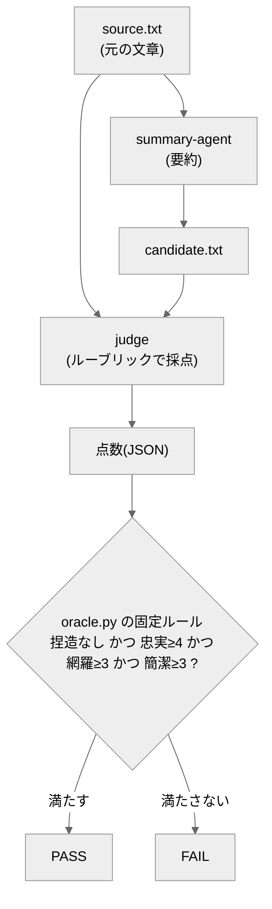

# llm-judge-summary-agent

**正解が一つに決まらない出力**（ここでは「文章の1文要約」）を、**AI の審査員＋決まったルール**で合否判定するエージェント。

## 概要

要約・対話・文章のような出力には「唯一の正解」がありません。こうした出力をどう評価するかという問題に対し、このリポジトリは **LLM-as-Judge（AI を審査員にする）** の実例を示します。

肝は **役割を2つに分ける**ことです：

- **採点は AI**（審査員）… 基準表（ルーブリック）に沿って、忠実さ・要点・簡潔さなどを点数化。
- **合否の線引きは固定ルール**（プログラム）… その点数を、決まったしきい値で PASS/FAIL に変換。

こうすると、AI の曖昧さを「採点」に閉じ込めつつ、合否そのものは**再現可能**になります。

## クイックスタート

必要なもの：Python 3 のみ（追加インストール不要）。**コマンドはリポジトリのルートで実行**します。

**(1) 合否ルール（ゲート）の自己チェック**（良い採点は PASS、悪い採点は FAIL、を確認）：

```bash
python eval/oracle.py --selftest
```

→ ②では悪い採点に **FAIL が出るのが正常**。最後に次が出れば成功：

```
## ゲート判定: PASS（合否ルールは妥当）
```

**(2) 1件の採点を合否に通す**（同梱サンプル）：

```bash
python eval/oracle.py --scores eval/selftest/good.scores.json          # → PASS
python eval/oracle.py --scores eval/selftest/bad_faithfulness.scores.json   # → FAIL
```

## エージェントの動かし方（採点JSONの作り方）



このリポジトリは2つの定義を持ちます：要約役 `agent/summary-agent.md` と 審査員 `eval/judge.md`。どちらも **Claude/LLM 用の指示書**で、呼ばれて初めて動きます。

1. **要約**：要約役に `source` を渡して `candidate.txt`（1文要約）を作る。
2. **採点**：審査員に `source` と要約を渡し、ルーブリック（`eval/rubric.md`）で採点 → 点数（JSON）。
3. **合否**：その JSON を `eval/oracle.py` が固定ルールで PASS/FAIL に。

採点（JSON 生成）は LLM が行い、**自動化しているのは合否ゲートのみ**です（正直に言うと、ここは完全自動ではありません）。読者は、同梱の `eval/selftest/*.scores.json` を使えば、エージェントを動かさずにゲートの挙動を確認できます。

採点 JSON を合否ゲートに通すとき：

```bash
python eval/oracle.py --scores <採点JSONのパス>
```

## 合否の基準（eval）

`捏造なし かつ 忠実性≥4 かつ 網羅性≥3 かつ 簡潔性≥3` なら PASS。

審査員も間違えうるので、`good`（良い要約）と `bad_*`（捏造・要点欠落）の見本を**ラベルを伏せて**採点させ、きちんと弾けるかを確認しています。

## ファイル構成

- `agent/summary-agent.md` … 要約役エージェントの定義。
- `eval/judge.md` … 審査員（LLM-as-Judge）の定義。`eval/rubric.md` … 採点基準。
- `eval/oracle.py` … 合否ゲート（決定的。`--selftest` 内蔵）。
- `eval/corpus/<ケース>/` … `source.txt`（お題）/ `good.txt`（良い要約）/ `bad_*.txt`（悪い要約の見本）。
- `eval/selftest/` … 合否ルール検証用の採点サンプル。
- `candidate.txt` / `candidate.scores.json` … エージェントが生成する要約と採点（`.gitignore` 対象。clone 直後は存在しません）。
- `design/design.md` … 設計の考え方。

---

自作 AI エージェント集（評価駆動開発の実証）の一つ。手法の背景は [design/design.md](design/design.md) を参照。
